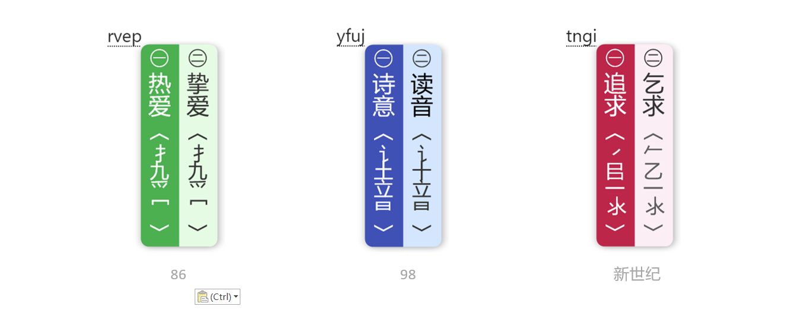

## 写给热爱打字的你

> 我们曾是诗的国度，你我的魂早已浸透了仓颉的恩泽。   
> 相信你也曾像太白一样诗意盎然，忽复乘舟梦日边。   
> 也曾执管挥毫，畅想兰亭轶闻，放浪形骸于山水之间。   
> 你有你的故事，我有我的酒。   
> 用最初的文字，记录每一处痕迹，直到盛满整个星汉。   
> 当你用它打字时，你就成了最浪漫的诗人！  

## 打字表现

### Windows 端表现



### MacOS 端表现


## 配置说明

### 初次安装

1. 下载官方 [Rime 小狼毫版本安装包](https://rime.im/download/)，并安装到目标机器
2. 下载本方案，将所有文件覆盖到 **Rime** 的用户目录下（最好是先删除原有配置，再全部复制进去）
3. 打开 **font** 文件夹，安装其中的 **黑体字根.ttf** 字体
4. 重新部署 **Rime**，就可以打字了（默认是 86 版五笔方案）

### 切换五笔版本

在本方案的根目录，找到 `tables` 文件夹，该文件夹下的子文件夹 `86/98/06` 分别内置了不同版本的码表，以新世纪版本为例，打开 `tables/06` 文件夹后，将里面所有的内容覆盖到 Rime 用户目录下，重新部署，即可切换为新世纪五笔。

## 基本功能

### 快捷键

|快捷键|功能|
| ---- | ---- |
|ctrl + `|菜单项|
|ctrl + shift + h|拆分显示与隐藏|
|ctrl + shift + j|编码提示与隐藏|
|ctrl + shift + f|繁简转换|
|ctrl + shift + u|生僻字显示与隐藏|
|shift|中英文切换|
|shift + space|全角半角切换|
|ctrl + .|中英文标点切换|

### 功能键

|功能键|功能|
| ----- | ---- |
|help|帮助菜单|
|mode|模式切换菜单|
|date|显示当前日期|
|time|显示当前时间|
|week|显示当前星期|
|nl|显示当前农历|
|jq|显示当前二十四节气|
|z|反查，重复上次上屏内容|
|`|临时自造词|
|~|以形查音|
|=|激活计算器功能和大小写金额转换功能|
|==|激活农历反查功能|

### 系统日期显示

以下功能默认处于开启状态。

|编码|说明|
| ----- | ---- |
|date|输出当天日期|
|time|输出当前时间|
|week|输出当前星期|

除了以上三个编码可以输出系统时间外，另添加以下关键词，用以输出对应的日期与日间。  
这些关键词包括：【今天、昨天、前天、明天、后天、时间、本周、上周、下周、本月、上月和下月】。  
其中【上月】和【下月】输出的结果如果月末天数不同时按最小月末数计算。

## 常用自定义配置

*以下配置说明按 `wubi.shema.yaml` 方案作为参考，其同样适用于 `wubi_dz.shema.yaml` 等其他方案的配置。*  
**以下所有的配置，都推荐在 `方案.custom.yaml` 中以补丁的方式配置（如果没有对应的 `.custom.yaml` 文件，请自行创建），以避免在更新项目的时候导致个人配置信息丢失！**  
*`方案.custom.yaml` 中的补丁写法，请参照 [定制指南（初阶）](https://github.com/rime/home/wiki/CustomizationGuide)。*  


**注意：在 `custom` 文件首行一定要添加一行注释，避免 `Rime` 解析出错。**

### 自定义候选项个数

默认的候选个数是 `5` 个。文件位置 `wubi.custom.yaml`。

```yaml
# wubi shema setting

patch:
  "menu/page_size": 9
```

### 自定义候选序号样式

默认的序号格式是带圆圈的中文数字符号。文件位置 `wubi.custom.yaml`。

```yaml
# wubi shema setting

patch:
  "menu/alternative_select_labels": [ 〡, 〢, 〣, 〤, 〥, 〦, 〧, 〨, 〩, 〸, 〹, 〺 ]
```

### 四码唯一自动上屏

文件位置 `wubi.custom.yaml`

```yaml
# wubi shema setting

patch:
  "speller/auto_select": true
```

### 回车清空编码

默认情况下，回车会将编码上屏。如果需要设置为回车清空编码，可以按下方法进行修改。

文件位置 `wubi.custom.yaml`

```yaml
# wubi shema setting

patch:
  key_binder/bindings/+:
    - {accept: Return, send: Escape, when: composing}
    - {accept: Return, send: Escape, when: has_menu}
```

### 空码时自动清除编码

文件位置 `wubi.custom.yaml`，本例中，节点有引号和无引号的写法都是可以被正确解析的。

```yaml
# wubi shema setting

patch:
  speller/max_code_length: 4   
  "speller/auto_clear": max_length
```

### 开启自动调频

自动调频功能默认是关闭状态，如需要开启自动调频功能，可参考以下方法。

文件位置 `wubi.custom.yaml`

```yaml
# wubi shema setting

patch:
  translator/enable_user_dict: true
```

### 开启自动造词

自动造词需要满足以下条件：
1. 禁用四码唯一自动上屏功能；
2. 句子输入模式开启；
3. 开启用户词典功能；

文件位置 `wubi.custom.yaml`，此时，将同时开启自动调频、自动造词功能。

```yaml
# wubi shema setting

patch:
  speller/max_code_length: 0   # 最长编码长度，0表示不设置长度
  speller/auto_select: false  # 关闭自动上屏
  translator/enable_sentence: true  # 开启句子输入模式（连打模式）
  translator/enable_user_dict: true  # 启用用户词典
  translator/enable_encoder: true  # 启用编码器
```

### 顶字上屏功能

顶字上屏功能简称「顶功」，这种模式需要固定最长编码为 `4`，并且禁用**四码唯一时自动上屏功能**，配置如下。

文件位置 `wubi.custom.yaml`。

```yaml
# wubi shema setting

patch:
  speller/max_code_length: 4   # 最长编码长度，0表示不设置长度
  speller/auto_select: false  # 关闭自动上屏
```

### 外观文字横向排列

以 windows 端为例，默认外观的文字是竖向排列的，如果想将其修改为横向排列，可以 `weasel.custom.yaml` 中进行修改，这个文件一般是在部署时自动生成的，如果没有该文件，请手动创建一个。

```yaml
# weasel.custom setting

patch:
  "style/vertical_text": false  # 是否启用文本纵向显示
```

### More

更多配置详情，可前往 [Wiki 页](https://gitee.com/hi-coder/rime-wubi/wikis/Home) 进行了解。

## 空山词库

本方案的三版词库在单字数量和词组数量上保持了一致。
在设计码表的时候，采用了三码以内出单字，四码出字词的模式。

因为很多人都头疼单字的识别码，因此在本方案的词库中对所有包含识别码的单字进行了单独编码，称其为**次全码单字**。例如「吾」的全码是`gkf`，但在输入`gk`时即可被检索到，而且不会影响`gkf`全码。候选栏中的重码变多了，但首选位置固定的简码是不变的，喜欢打全码可以忽略其他候选项，使用识别码来精准定位到最终结果。而对于一时想不起识别码的单字，只要拆出完整字根，它就一定会出现在候选栏里，这种确信的结果对于某些结构不明确的字来说，大大减轻了大脑从字根拆解到结构识别的能量消耗。

在简码单字候选中，如果某个单字在前一级简码的首选位出现过，则会让位到最后一位。同理，在全码字词中，如果任意简码首选项中出现过该字，则其会让位到字词的最后一位。（例外：所有的生僻字默认处于最后一位）


#### 排序说明

一简：首选项为一简单字，次级选项为键名汉字。  
二简：首选项为二简单字，次级选项为二级次全码单字。  
三简：首选项为三简单字，次级选项为三级次全码单字。候选的单字按常用字字频做了排序，并且，如果三简中的单字在一简二简首选位置出现过，则退让到最后一位。  
四全：单字与词组按先用词频数据进行了排序，如果与词组一同出现的单字在一简二简三简首选位出现过，则不参与排序，直接安置于最后位置。  
*生僻字不参与以上排序逻辑，生僻字需要打全编码显示，并且永远排在最后一位。*

## 中书君

中书君是针对本方案的一个管理器，旨在帮助广大用户简化 Rime 方案的配置难度。（目前中书君项目还处于 alpha 的内研阶段，beta 正式版还未正式上线。）以下是图示：


项目体验地址：
- Gitee 地址：https://gitee.com/hi-coder/WubiMaster
- Github 地址：https://github.com/mrshiqiqi/WubiMaster

## 捐赠 🌻

> 感谢您选择并使用这款开源软件！您的信任与支持是我持续前进的动力。  
> 开源软件的研发与维护离不开开发者的辛勤付出与无私奉献。为了保持软件的持续更新与优化，恳请您在能力范围内考虑对本项目进行捐赠。  
> 您的每一份捐赠，都将直接用于软件的开发、测试、维护以及优化，帮助更多用户享受到更好的使用体验。  
> 您可以选择通过支付宝、微信等在线支付平台进行捐赠，捐赠金额不限，您的每一份心意我都将倍加珍惜。  
>  再次感谢您的支持与厚爱！祝您生活愉快，工作顺利！  
> 空山明月 敬上


### 捐赠记录

|日期|捐赠者|金额|留言|
| ----- | ----- | ----- | ----- |
|2024-5-6|**飞|30.00|请保持维护和更新，我一直在用新世纪的码表|
|2024-5-7|天青色|10.00|空山佬的方案让我再次爱上了五笔|
|2024-5-8|An|5.00|无|
|2024-5-8|*|50.00|无|
|2024-05-15|YG777|66.00|无|
|2024-05-16|悟空|30.00|无|
|2024-05-18|WIIMOO|120.00|怎能辜负了这群为爱发电的战士，记得我的五笔拼音长语句输入哦|
|2024-5-20|曵景成文|33.00|共攀书山，致敬前行者|

## QQ群

欢迎加入！


## 有问有答

*问：我部署了 `98` 版码表文件，但想用 `86` 的外观主题，请问怎么配置？*

> 答：在 `tables` 目录的子文件下，含有不同版本的码表文件及一个外观主题文件 `weasel.yaml`，可以将 `tables/86/weasel.yaml` 替换到用户目录下，重新部署，即可使用 `诗意之春` 主题。

*问：更换外观主题后重新部署，但主题还是 `86` 方案默认的绿色主题，这个问题怎么解决？*

> 答：本项目默认不提供任何 `.custom.yaml` 配置文件，因此，在部署完成后，用户目录下会生成一个空的 `weasel.custom.yaml` 文件。解决方法有两种，一种是在这个文件首行添加一行注释，即以 `#` 开头的文字描述，另一种是将这个文件删除。之后再重新部署，新更新的主题即可显现。

## 相关链接

### 项目镜像地址
- Gitee 地址：https://gitee.com/hi-coder/rime-wubi
- Github 地址：https://github.com/mrshiqiqi/rime-wubi

### Rime 输入法引擎
- Rime 官网：https://rime.im
- Rime 下载地址：https://rime.im/download
- Rime 帮助文档：https://rime.im/docs
- 小狼毫项目地址：https://github.com/rime/weasel
- 鼠须管项目地址: https://github.com/rime/squirrel
- 中州韵项目地址：https://github.com/rime/ibus-rime
- 小狼毫外观配置说明文档：https://github.com/rime/weasel/wiki
- 小狼毫配色工具：https://bennyyip.github.io/Rime-See-Me
- 鼠须管配色工具：https://gjrobert.github.io/Rime-See-Me-squirrel

### 中书君项目
- Gitee 地址：https://gitee.com/hi-coder/WubiMaster
- Github 地址：https://github.com/mrshiqiqi/WubiMaster

---

赠人玫瑰，手有余香！🌹  
帮忙👇点个<kbd>⭐</kbd>，星标数量越多，越能让更多人发现这个项目！